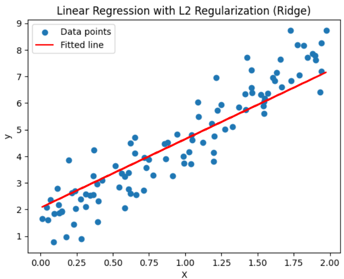

# Linear Regression from Scratch with L2 Regularization (Ridge Regression)

This project implements a simple linear regression model using gradient descent and L2 regularization (Ridge Regression) **from scratch** in Python, without relying on any machine learning libraries.

  
*Fitted regression line on synthetic data*

## Motivation

Linear regression is the foundation of many machine learning models. Adding regularization helps prevent overfitting and improves generalization on unseen data.

This is the first project in my #30DaysMLProjects journey to build practical and market-relevant machine learning skills.

## Features

- Synthetic data generation with noise  
- Gradient descent optimization  
- L2 regularization to penalize large weights  
- Visualizations of regression line and loss convergence  

## Usage

1. Clone the repository:

   ```bash
   git clone https://github.com/your-username/linear-regression-ridge.git
   cd linear-regression-ridge
Install required packages:

bash
Copy
Edit
pip install numpy matplotlib
Run the script:

bash
Copy
Edit
python linear_regression_ridge.py
Check the terminal for learned parameters and view the generated plots.

Learning Outcomes
Understand and implement linear regression mathematically

Learn the importance of regularization to reduce overfitting

Practice optimization using gradient descent

Visualize model fit and training loss convergence

File Structure
bash
Copy
Edit
linear-regression-ridge/
│

├── linear_regression_ridge.py    # Main implementation script

├── README.md                     # This file

└── images/                       # Folder containing plot images (optional)
    ├── fit_plot.png
    └── loss_curve.png
    
Author
Shadabur Rahaman — www.linkedin.com/in/shadabur-rahaman-1b5703249

