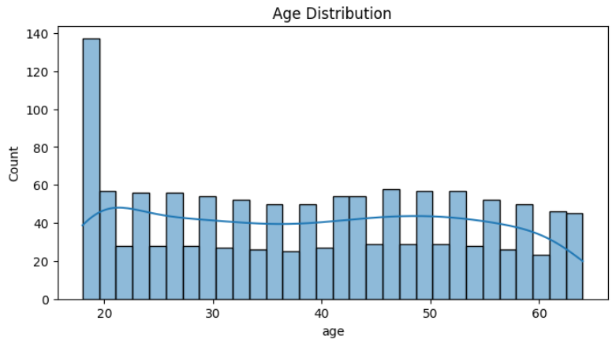

````markdown
# Day 2: EDA & Feature Engineering on Insurance Cost Dataset

This project performs advanced Exploratory Data Analysis (EDA) and feature engineering on the Medical Cost Personal Dataset from Kaggle, preparing data for downstream modeling.

  
*Histogram showing the distribution of policyholder ages.*

## Motivation

Understanding your data deeply—and engineering the right features—is critical to building robust ML models. On Day 2 of my #30DaysMLProjects journey, I dove into:

- Automated data profiling  
- Visualizing key variable relationships  
- Creating domain-informed features  

## Features

- Automated profiling report via **ydata-profiling**  
- Histograms & boxplots of `age`, `bmi`, `charges`, and smoker status  
- Correlation heatmap to reveal feature interactions  
- New features:
  - `age_bin` (Child/Teen/Young/Adult/Senior)  
  - `age_bmi_interaction`  
  - `charges_log` (log-transformed target)  
  - `family_size` = `children + 1`  
  - One-hot encoded `sex`, `smoker`, and `region` columns  

## Usage

1. **Clone the repo**  
   ```bash
   git clone https://github.com/your-username/insurance-eda-fe.git
   cd insurance-eda-fe
````

2. **Install dependencies**

   ```bash
   pip install -r requirements.txt
   ```

3. **Run the cleaning & feature script**

   ```bash
   python src/clean_and_feature.py
   ```

   (Or open the notebook:)

   ```bash
   jupyter lab notebooks/Day2_EDA_and_FeatureEngineering.ipynb
   ```

## Learning Outcomes

* Generate automated EDA reports
* Interpret distribution plots and correlation matrices
* Engineer meaningful features using domain knowledge
* Save a clean, ready-to-model dataset (`insurance_clean.csv`)

## File Structure

```
insurance-eda-fe/
│
├── data/
│   ├── raw/
│   │   └── insurance.csv
│   └── processed/
│       └── insurance_clean.csv
│
├── notebooks/
│   └── Day2_EDA_and_FeatureEngineering.ipynb
│
├── reports/
│   └── ydata_profile_report.html
│
├── images/
│   ├── age_distribution.png
│   ├── charges_boxplot.png
│   └── correlation_heatmap.png
│
├── src/
│   ├── eda.py
│   └── features.py
│   └── clean_and_feature.py   # Combines cleaning & feature-engineering steps
│
├── requirements.txt
├── .gitignore
└── README.md
```

## Author

**Shadabur Rahaman**
[LinkedIn](https://www.linkedin.com/in/shadabur-rahaman-1b5703249) | [GitHub](https://github.com/your-username)

```

— Copy & paste this `README.md` into your repo root to match Day 2’s structure and style.
```

