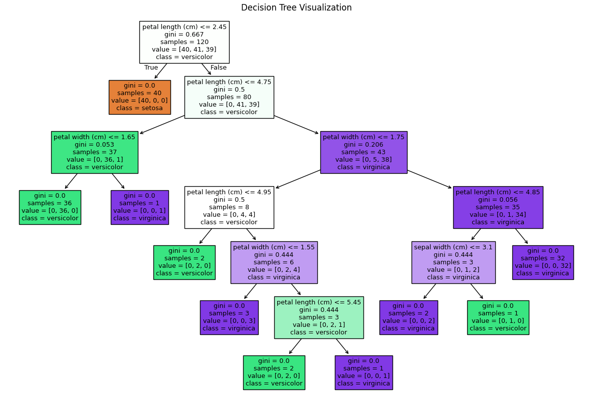

# Decision Tree Classifier on Iris Dataset 🌸

This project implements a **Decision Tree Classifier** on the famous Iris dataset, demonstrating a complete machine learning pipeline: data preprocessing, model training, evaluation, and visualization.

  
*Pairwise feature relationships for different species*

## 🔍 Project Overview

This is Day 5 of my **#30DaysMLProjects** challenge to build practical, market-ready machine learning solutions.

In this project, we:
- Load and encode the Iris dataset
- Split the data into train-test sets
- Train a Decision Tree Classifier
- Evaluate model performance with a confusion matrix and classification report
- Visualize decision boundaries and relationships

## 🧠 Features
- Clean preprocessing with automatic label encoding  
- Model training using `DecisionTreeClassifier` from `scikit-learn`  
- Visual analysis: pairplot and decision tree  
- Utility functions for clean, modular code  

## 🚀 How to Run

1. Clone the repo and navigate to the directory:
```bash
git clone https://github.com/Shadabur-Rahaman/30-days-ml-projects.git
cd Day5_DecisionTree_Iris_Classifier_Cleaned
Install dependencies:

pip install -r requirements.txt
Run the notebook:

jupyter notebook Day5_DecisionTree_Iris_Classifier_Cleaned.ipynb
🧪 Learning Outcomes
Practice classification using decision trees

Learn to encode categorical targets

Generate and interpret confusion matrices

Use visualization to analyze model performance

📁 Directory Structure
Day5_DecisionTree_Iris_Classifier_Cleaned/
├── Day5_DecisionTree_Iris_Classifier_Cleaned.ipynb  # Main notebook
├── dtree_utils.py                                   # Utility script
├── requirements.txt                                 # Required packages
├── .gitignore                                       # Ignored files
├── README.md                                        # Project description
└── images/                                          # Saved visualizations
    ├── pairplot.png
    └── confusion_matrix.png
👨‍💻 Author
Shadabur Rahaman
📎 LinkedIn
📂 Day 5 Project Repo

