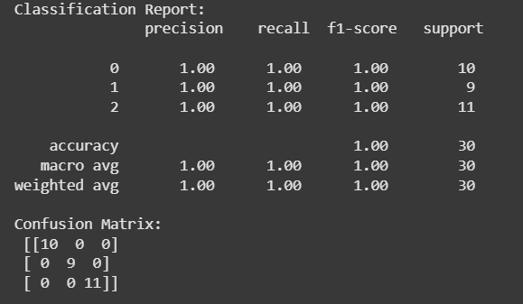
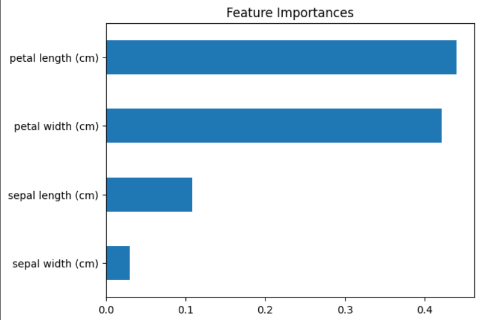

# 🌲 Random Forest Iris Classifier (Cleaned)

This project implements a Random Forest Classifier on the Iris dataset with clean modular code. It includes training, evaluation, and feature importance visualization.
---




---

## 🔍 Project Highlights

- Clean modular code (`rf_utils.py`)
- Confusion matrix and accuracy evaluation
- Feature importance visualization
- Follows Day 6 of #30DaysMLProjects

---

## 📁 Structure

Day6_RandomForest_Iris_Classifier_Cleaned/
├── data/
│ └── iris.csv
├── notebooks/
│ └── Day6_RandomForest_Iris_Classifier_Cleaned.ipynb
├── src/
│ └── rf_utils.py
├── images/
│ ├── confusion_matrix.png
│ └── feature_importance.png
├── requirements.txt
├── .gitignore
└── README.md


---

## 🚀 How to Run

1. Clone the repo:

```bash
git clone https://github.com/Shadabur-Rahaman/30-days-ml-projects.git
cd Day6_RandomForest_Iris_Classifier_Cleaned
Install requirements:


pip install -r requirements.txt
Run the notebook inside notebooks/.

🎯 Learning Outcomes
Understand how Random Forest works

Learn model evaluation via confusion matrix & classification report

Visualize feature importances for better interpretability

📌 Author
Shadabur Rahaman
🔗 LinkedIn
📁 GitHub Repo
