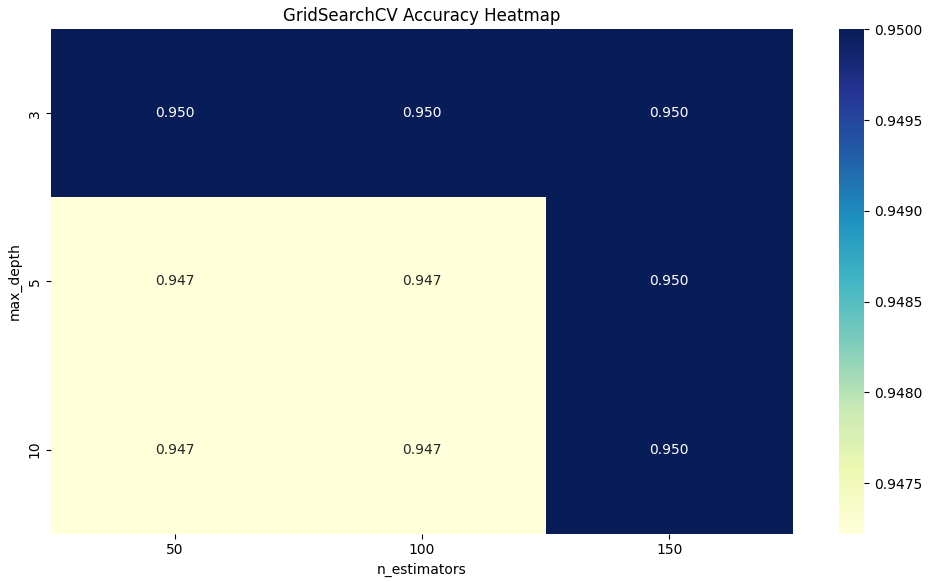

# GridSearchCV Hyperparameter Tuning - Day 7 of #30DaysMLProjects

This project demonstrates how to use **GridSearchCV** to tune hyperparameters and optimize model performance on the Iris dataset. By automating the search process, we identify the best parameter combinations to improve accuracy.



## 🔍 Objective

To improve classifier performance using hyperparameter tuning via `GridSearchCV` with cross-validation.

## ✅ Features

- Train/Test split and model evaluation
- Hyperparameter tuning with `GridSearchCV`
- Evaluation of different parameter sets
- Heatmap & bar chart visualization of results

## 🛠 Libraries Used

- `scikit-learn`
- `pandas`
- `matplotlib`
- `seaborn`

## 🚀 Run This Project

1. Clone the repo:
```bash
git clone https://github.com/Shadabur-Rahaman/30-days-ml-projects.git
cd Day7_GridSearchCV_Hyperparameter_Tuning_Cleaned
Install requirements:


pip install -r requirements.txt
Open and run the notebook:


jupyter notebook Day7_GridSearchCV_Hyperparameter_Tuning_Cleaned.ipynb
📁 Directory Structure

Day7_GridSearchCV_Hyperparameter_Tuning_Cleaned/
│
├── Day7_GridSearchCV_Hyperparameter_Tuning_Cleaned.ipynb
├── tuning_utils.py
├── images/
│   ├── gridsearch_heatmap.png
│   └── accuracy_barplot.png
├── requirements.txt
├── .gitignore
└── README.md
👨‍💻 Author
Shadabur Rahaman
LinkedIn
