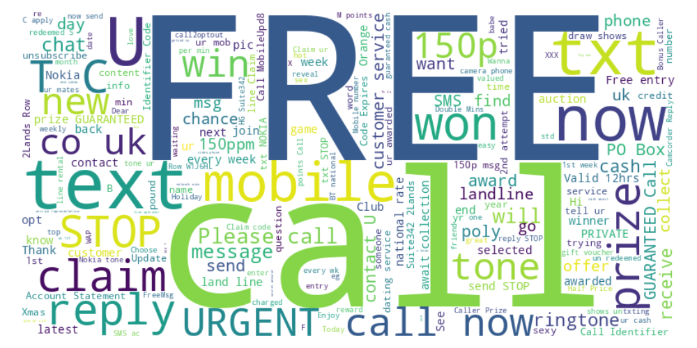

# Naive Bayes Text Classifier (SMS Spam Detection)

A simple spam classifier built using the Naive Bayes algorithm on SMS text messages. This is part of my #30DaysMLProjects series.



## 📌 Features

- Cleaned SMS dataset with labels (spam/ham)
- Text preprocessing using CountVectorizer
- Naive Bayes classification with scikit-learn
- Evaluation via confusion matrix & classification report
- WordCloud visualization

## 📁 Project Structure

```bash
Day8_NaiveBayes_Text_Classifier_Cleaned/
├── data/
│   └── sms_spam.csv
├── images/
│   ├── confusion_matrix.png
│   └── wordcloud.png
├── notebooks/
│   └── Day8_NaiveBayes_Text_Classifier_Cleaned.ipynb
├── src/
│   └── nb_utils.py
├── requirements.txt
├── .gitignore
└── README.md
🚀 How to Run
Clone the repository:

git clone https://github.com/Shadabur-Rahaman/30-days-ml-projects.git
cd Day8_NaiveBayes_Text_Classifier_Cleaned
Install dependencies:

pip install -r requirements.txt
Run the notebook or call functions from nb_utils.py.

📊 Learning Outcome
Fundamentals of Naive Bayes text classification

Preprocessing text data for ML

Evaluating classification performance

Creating word clouds from textual data

Author:
Shadabur Rahaman
LinkedIn
