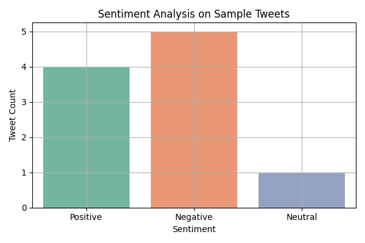

# Tweet Sentiment Analysis using VADER & TextBlob

This project performs sentiment analysis on tweets using two techniques:
- **TextBlob** for polarity scoring
- **VADER** (Valence Aware Dictionary and sEntiment Reasoner) from NLTK



## 🚀 Features
- Load and clean tweets
- Apply TextBlob and VADER sentiment scoring
- Visualize sentiment distribution
- WordClouds for positive and negative tweets

## 🔧 How to Run
1. Install dependencies:
```bash
\
📁 Folder Structure
Day9_Tweet_Sentiment_Analysis_Cleaned/
├── data/
│   └── tweets.csv
├── notebooks/
│   └── Day9_Tweet_Sentiment_Analysis_Cleaned.ipynb
├── images/
│   ├── wordcloud_positive.png
│   ├── wordcloud_negative.png
│   └── sentiment_distribution.png
├── src/
│   └── sentiment_utils.py
├── requirements.txt
├── .gitignore
└── README.md

pip install -r requirements.txt
Run the notebook:
jupyter notebook notebooks/Day9_Tweet_Sentiment_Analysis_Cleaned.ipynb

✍️ Author
Shadabur Rahaman
🔗 LinkedIn

