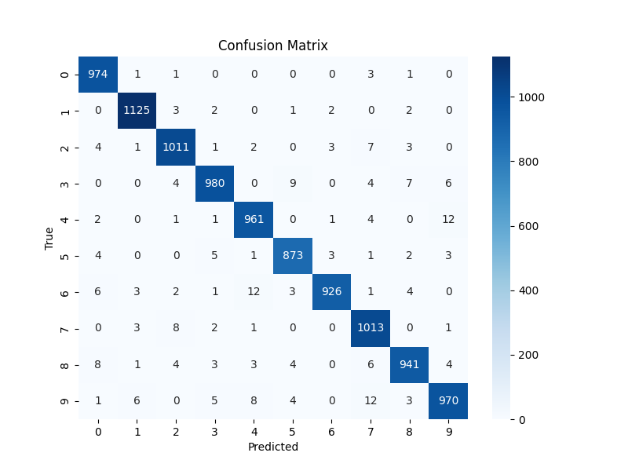

# MNIST Handwritten Digit Classifier with Keras

This project uses a simple neural network built with Keras to classify handwritten digits from the MNIST dataset.



## 🔍 Overview

- Dataset: MNIST (28x28 grayscale images)
- Model: 3-layer dense neural network
- Framework: TensorFlow/Keras
- Metrics: Accuracy, Loss, Confusion Matrix

## 📌 Highlights

- Data loading directly from Keras datasets
- Normalization and one-hot encoding
- Training/validation split
- Evaluation with accuracy and confusion matrix
- Visualizations of loss curve and confusion matrix

## 📁 File Structure
## 🚀 How to Run

```bash
Day_10_Keras_MNIST_NN_Cleaned/
├── notebooks/
│ └── Day10_Keras_MNIST_NN_Cleaned.ipynb
├── images/
│ ├── training_loss_curve.png
│ └── confusion_matrix.png
├── src/
│ └── keras_nn_utils.py
├── requirements.txt
├── .gitignore
└── README.md

pip install -r requirements.txt

Open and run all cells in:
notebooks/Day10_Keras_MNIST_NN_Cleaned.ipynb

📚 Learning Outcomes
1. Understand the basics of neural networks
2. Apply Keras to build image classification models
3. Visualize model performance with loss curves and confusion matrix
