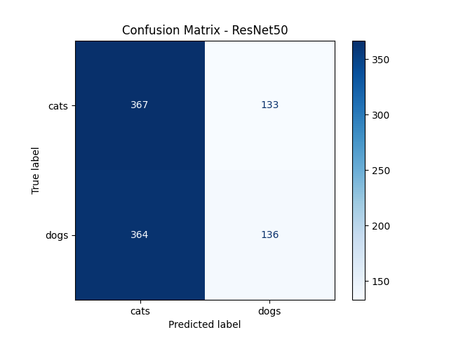

# 🧠 Day 12 – Transfer Learning with ResNet50

This project demonstrates transfer learning using the pre-trained ResNet50 model from Keras Applications. The model is fine-tuned to classify custom image datasets with improved efficiency and performance.



## 📌 Overview

- Base Model: ResNet50 (pre-trained on ImageNet)
- Strategy: Feature extraction + Fine-tuning
- Input: Custom image dataset (class-wise folder structure)
- Output: Multi-class image classification
- Framework: TensorFlow / Keras

## 🚀 Key Steps

- Image preprocessing and augmentation
- Freezing base layers and adding custom classifier
- Fine-tuning selected layers
- Evaluation: Accuracy, loss curves, and confusion matrix
- Prediction visualization

```bash
## 📁 File Structure

Day12_Transfer_Learning_ResNet50_Cleaned/
├── data/
│ └── images/
├── notebooks/
│ └── Day12_Transfer_Learning_ResNet50_Cleaned.ipynb
├── images/
│ ├── training_accuracy_loss.png
│ ├── confusion_matrix_resnet50.png
│ └── prediction_grid.png
├── src/
│ └── resnet50_utils.py
├── requirements.txt
├── .gitignore
└── README.md

perl
Copy
Edit

## 🛠️ How to Run

```bash
pip install -r requirements.txt
Open the notebook and run all cells:

Copy
Edit
notebooks/Day12_Transfer_Learning_ResNet50_Cleaned.ipynb
