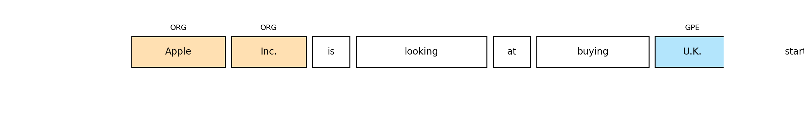

# Named Entity Recognition (NER) with spaCy and Transformers

This project focuses on building a robust NER (Named Entity Recognition) pipeline using `spaCy` with support from Hugging Face `transformers`. We train and evaluate NER models on a custom entity-labeled dataset.



## 🔍 Overview

- **Dataset:** Custom annotated text in spaCy format (JSON)
- **Models:** spaCy + `transformers` pipeline (e.g., RoBERTa, BERT)
- **Tools:** spaCy, Transformers, Scikit-learn
- **Task:** Extract named entities (e.g., Person, Organization, Location)

---

## 📌 Features

- Load and visualize spaCy-compatible NER datasets
- Train transformer-backed NER models using spaCy v3.x
- Evaluate model with precision, recall, and F1-score
- Save and reload trained models
- Visualize predictions

---
```bash
## 📁 File Structure

Day14_NER_spaCy_Transformers_Cleaned/
├── data/
│ └── ner_dataset.json
├── notebooks/
│ └── Day14_NER_spaCy_Transformers_Cleaned.ipynb
├── images/
│ ├── ner_annotations_example.png
│ └── model_eval_metrics.png
├── src/
│ └── ner_utils.py
├── outputs/
│ └── ner_model/
├── requirements.txt
├── .gitignore
└── README.md

yaml
Copy
Edit

---

## 🚀 How to Run


# Install requirements
pip install -r requirements.txt

# Train the model
python -m spacy train config.cfg --output ./outputs/ner_model

# Predict using the trained model
python -m spacy evaluate outputs/ner_model/model-best data/ner_dataset.json
📚 Learning Outcomes
Learn to integrate HuggingFace Transformers with spaCy for NER

Understand the pipeline of training spaCy-based transformer models

Evaluate NER performance and visualize entity detection

📌 This is Day 14 of my #30DaysMLProjects journey.
