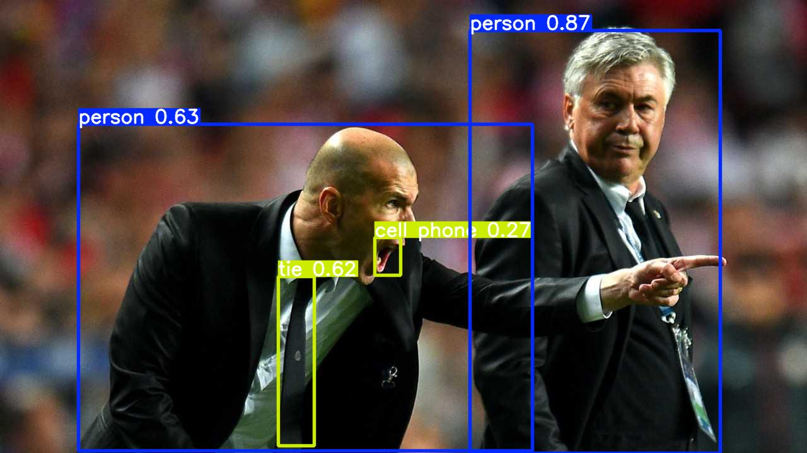

# Object Detection with YOLOv5 🦾

This project demonstrates object detection using YOLOv5 on a sample dataset. YOLO (You Only Look Once) is a popular deep learning-based approach for real-time object detection tasks.



## 🔍 Overview

- **Model:** YOLOv5s (small variant for speed and demo purposes)
- **Framework:** PyTorch + Ultralytics YOLOv5
- **Task:** Detect objects and draw bounding boxes on images

## 📌 Features

- Pretrained YOLOv5 weights
- Inference on custom images
- YOLO-format dataset structure
- Visualized predictions with bounding boxes

## 📁 File Structure
```bash
Day_15_ObjectDetection_YOLO_Cleaned/
├── notebooks/
│ └── Day_15_Object_Detection_YOLO_Cleaned.ipynb
├── images/
│ ├── prediction_img1.png
│ └── prediction_img2.png
├── src/
│ └── yolo_utils.py
├── models/
│ └── yolov5s.pt
├── requirements.txt
├── .gitignore
└── README.md

## 🚀 How to Run


# Clone YOLOv5 repo
git clone https://github.com/ultralytics/yolov5
cd yolov5
pip install -r requirements.txt

# Run inference (inside notebook or script)
python detect.py --weights models/yolov5s.pt --source data/images/
