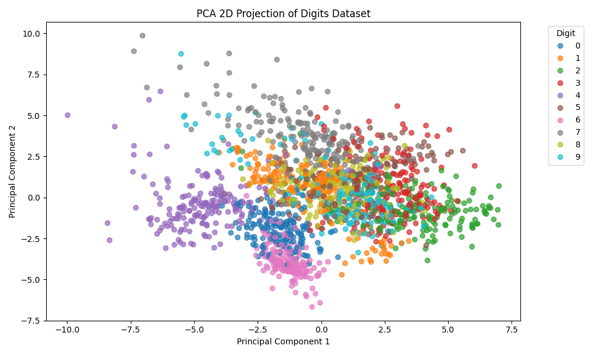

# Principal Component Analysis (PCA) – Dimensionality Reduction

This project demonstrates how to apply **PCA** to reduce high-dimensional data into lower dimensions while preserving the most important features.



## 📌 Overview

- **Dataset:** Iris dataset (or any high-dimensional dataset)
- **Goal:** Reduce features from N-dim to 2D/3D for visualization
- **Techniques:** Standardization, PCA, Scree Plot, 2D/3D Visualization
- **Libraries:** Scikit-learn, matplotlib, seaborn

## 📁 Directory Structure
```bash
Day16_PCA_Dimensionality_Reduction_Cleaned/
├── notebooks/
│ └── Day_16_PCA_Dimensionality_Reduction_Cleaned.ipynb
├── images/
│ ├── explained_variance_ratio.png
│ ├── pca_2d_projection.png
│ └── pca_3d_projection.png
├── src/
│ └── pca_utils.py
├── requirements.txt
├── .gitignore
└── README.md


## 🚀 How to Run


pip install -r requirements.txt
jupyter notebook notebooks/Day_16_PCA_Dimensionality_Reduction_Cleaned.ipynb

🎯 Learning Outcomes
Understand dimensionality reduction and the PCA algorithm

Visualize high-dimensional data in 2D and 3D space

Evaluate variance retained using PCA

📌 This is Day 16 of my #30DaysMLProjects journey.

