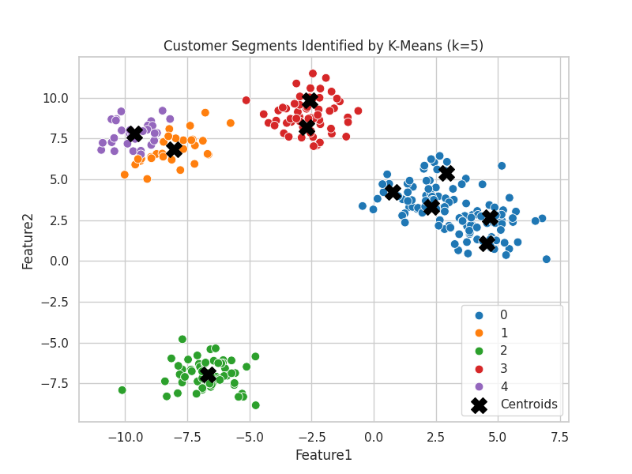

# KMeans Customer Segmentation – Day 17 of #30DaysMLProjects

This project applies **KMeans Clustering** to segment customers based on their demographic and spending behavior. A common and powerful unsupervised learning technique in marketing and business analytics.



## 🔍 Overview
- Dataset: Mall Customers (Age, Annual Income, Spending Score)
- Goal: Identify customer segments using clustering
- Algorithms: KMeans, Elbow Method
- Visualization: 2D and 3D cluster plots

## 📌 Highlights
- Cleaned and scaled input data
- Used **Elbow Method** to determine optimal `k`
- Performed clustering using Scikit-learn
- Visualized results in 2D & 3D

## 🧾 File Structure
```bash
Day17_KMeans_Customer_Segmentation_Cleaned/
├── notebooks/
│ └── Day17_KMeans_Customer_Segmentation_Full_Cleaned.ipynb
├── images/
│ ├── elbow_method_plot.png
│ ├── clustered_data_plot.png
│ └── raw_data_plot.png
├── src/
│ └── kmeans_utils.py
├── requirements.txt
├── .gitignore
└── README.md


## 🚀 How to Run

pip install -r requirements.txt
Open the Jupyter notebook in notebooks/ and run all cells.

📚 Learning Outcomes
Unsupervised clustering with KMeans

Importance of feature scaling

Elbow method and inertia analysis

Business use cases for customer segmentation

