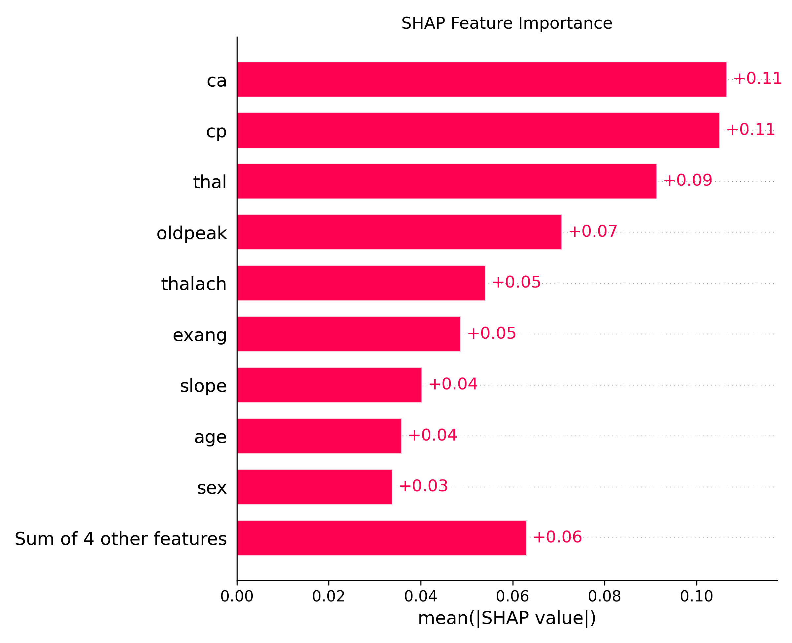
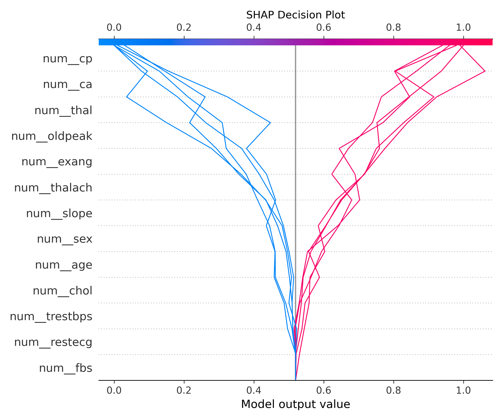
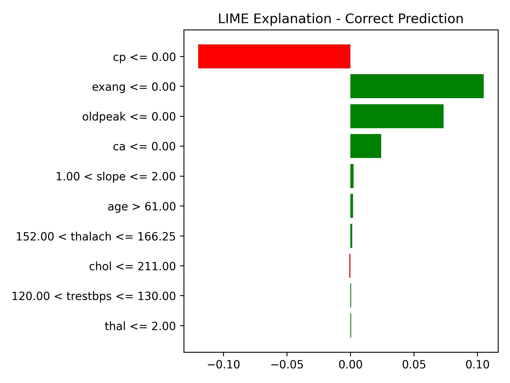

# 🧠 Explainable AI (XAI): SHAP, LIME, Grad-CAM

This project demonstrates the use of **Explainable AI (XAI)** techniques to understand predictions made by machine learning models, both for **tabular** and **image** data.

## 📌 Techniques Covered
- **SHAP**: Global & local interpretability using SHapley values
- **LIME**: Local interpretable model-agnostic explanations
- **Grad-CAM**: Visual explanation for CNN decisions
- **Partial Dependence Plot (PDP)**

---

## 📁 Project Structure

```bash
Day22_ExplainableAI_CNN_and_Tabular/
├── data/
│   ├── heart.csv                              # Tabular dataset for heart disease classification
│   └── test_samples/                          # Sample images used for CNN explainability
│
├── notebooks/
│   └── day_22_explainable_ai.ipynb            # Main notebook (image + tabular explainability)
│
├── images/
│   ├── gradcam_output.png                     # Grad-CAM visualization
│   ├── lime_explanation.png                   # LIME explanation over heart data
│   ├── lime_correct.png                       # LIME explanation on correctly predicted instance
│   ├── lime_incorrect.png                     # LIME explanation on incorrectly predicted instance
│   ├── shap_feature_importance.png            # SHAP feature importance bar plot
│   ├── shap_waterfall_plot.png                # SHAP waterfall for a single prediction
│   ├── shap_dependence_plot.png               # SHAP dependence between features
│   ├── shap_decision_plot.png                 # SHAP decision path visualization
│   └── pdp_thalach.png                        # Partial Dependence Plot for "thalach" feature
│
├── src/
│   ├── model_loader.py                        # Loads pretrained models (CNN or tabular)
│   ├── explainability_tools.py                # Grad-CAM, SHAP, LIME functions
│   └── image_utils.py                         # Image loading, preprocessing, plotting
│
├── artifacts/
│   ├── lime_explainer.joblib                  # Saved LIME explainer object
│   ├── shap_explainer.joblib                  # Saved SHAP TreeExplainer object
│   ├── lime_config.json                       # LIME configuration details
│   ├── shap_data.npy                          # SHAP input data
│   ├── shap_values.npy                        # SHAP value array
│   ├── shap_base_values.npy                   # SHAP base values
│   └── shap_feature_names.json                # JSON list of feature names used in SHAP
│
├── requirements.txt                           # Python packages required
├── .gitignore                                 # Git ignored files
└── README.md                                  # Project summary and usage
---

## 📊 Visualizations

| SHAP Feature Importance | SHAP Decision Plot |
|-------------------------|---------------------|
|  |  |

| LIME Explanation | Grad-CAM Overlay |
|------------------|------------------|
|  | *(Add image if CNN used)* |

---

## 🧪 How to Run

```bash
# Clone repo and navigate
git clone https://github.com/your-username/Day22_Explainable_AI.git
cd Day22_Explainable_AI

# Install dependencies
pip install -r requirements.txt

# Run notebook
jupyter notebook notebooks/Day22_Explainable_AI.ipynb
🧠 Learnings
Understand how SHAP assigns responsibility to features.

Use LIME to visualize feature perturbation and impact.

Generate Grad-CAM overlays for CNN image classification.

Build explainable pipelines for real-world tabular or vision-based ML tasks.

🚀 Future Scope
Use Anchors or Counterfactual Explanations.

Add Integrated Gradients for CNNs.

Extend to real-time XAI in production dashboards.

📅 Part of 30 Days of ML Projects
This is Day 22 of my #30DaysMLProjects challenge.

Stay tuned for Day 23: Anomaly Detection – Detect anomalies in network or transaction data 🔥
