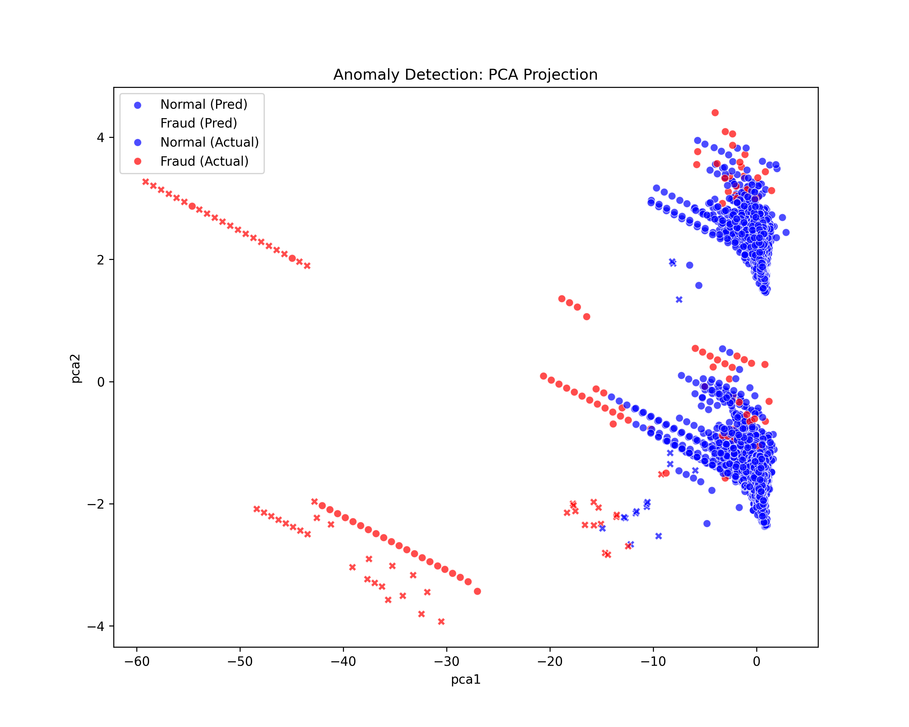

# 🚨 Anomaly Detection in Transaction/Network Data

This project applies unsupervised machine learning (Isolation Forest + PCA) to detect anomalies in transactional or network data using statistical outliers.



---

## 🔍 Overview

- **Goal**: Identify rare patterns or suspicious behavior (fraud, intrusion, system errors).
- **Algorithms**: Isolation Forest, PCA
- **Tools**: Scikit-learn, joblib, matplotlib, seaborn
- **Outputs**: Anomaly score distributions, prediction outputs, confusion matrix, and visual evaluation plots.

---
📊 Key Outputs
PCA Anomalies:

Confusion Matrix:


Precision vs Threshold:

Score Distribution:

🧠 Learnings
How to apply Isolation Forest for detecting anomalies.

Understanding score distribution and precision thresholds.

Using PCA to visually distinguish anomalies.

Visualizing evaluation results through confusion matrix and custom plots.
---
## 📁 Project Structure
```bash
Day23_Anomaly_Detection_Cleaned/
├── data/
│ └── filenames.txt
├── images/
│ ├── confusion_matrix.png
│ ├── pca_anomalies.png
│ ├── precision_threshold.png
│ └── score_distribution.png
├── notebooks/
│ └── Day23_Anomaly_Detection_Cleaned.ipynb
├── src/
│ ├── anomaly_utils.py
│ ├── preprocessing.py
│ └── plot_utils.py
├── requirements.txt
├── .gitignore
└── README.md

---

## 🚀 How to Run


pip install -r requirements.txt
Then open and execute all cells in:

notebooks/Day23_Anomaly_Detection_Cleaned.ipynb


📌 This is Day 23 of my #30DaysOfMLProjects challenge.

✅ Stay tuned for Day 24:
Autoencoders for Denoising Images – Use autoencoders to remove noise from images!
