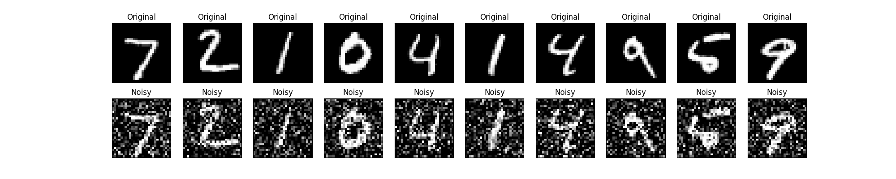
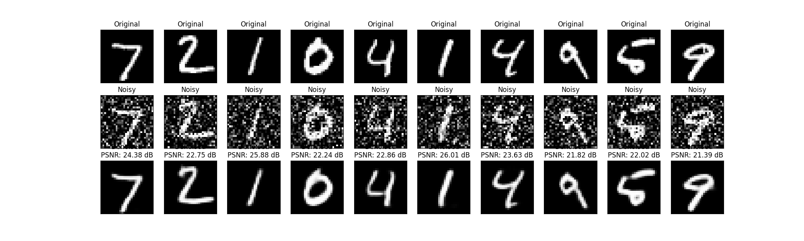
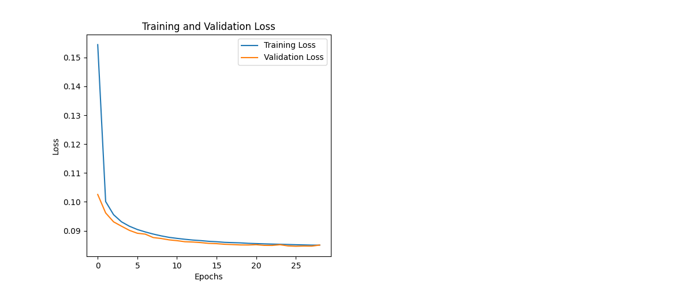

# 🧼 Autoencoder for Image Denoising

This project demonstrates the use of an autoencoder neural network to **remove noise from images**. It uses the MNIST dataset and applies **Gaussian noise** to create a corrupted input, then trains a model to restore the clean version.

## 📸 Visual Previews

| Original vs Noisy | Denoised Output | Training Loss |
|-------------------|------------------|----------------|
|  |  |  |

---

📚 Learning Outcomes
---
Understand the architecture of autoencoders

Apply Gaussian noise to image datasets

Train an encoder-decoder pipeline to restore noisy inputs

Visualize reconstruction performance and training history

🧠 Techniques Used
---
Keras/TensorFlow autoencoder model

Gaussian noise addition

Loss visualization

Image reconstruction

🚀 Day 24 of #30DaysOfMLProjects
---
Stay tuned for Day 25 – Autoencoders for Anomaly Detection!
## 📁 Project Structure
Day24_Autoencoder_Denoising_Cleaned/
├── images/
│   ├── autoencoder_model.png                # Autoencoder model architecture
│   ├── denoised_images.png                  # Reconstructed clean images
│   ├── original_vs_noisy.png                # Visualization of noise addition
│   └── training_history.png                 # Loss curves for training and validation
├── artifacts/
│   ├── autoencoder_model.h5                 # Trained autoencoder model
│   └── history.json                         # Saved training history
├── notebooks/
│   └── Day24_Autoencoder_Denoising_Cleaned.ipynb
├── src/
│   ├── model_utils.py                       # Build/save/load autoencoder model
│   ├── data_utils.py                        # Load, preprocess, and add noise to data
│   └── plot_utils.py                        # Visualize original, noisy, and denoised images
├── requirements.txt
├── .gitignore
└── README.md

- `notebooks/Day24_Autoencoder_Denoising_Cleaned.ipynb`: Main Jupyter notebook
- `src/model_utils.py`: Build, compile, and save/load the autoencoder
- `src/data_utils.py`: Load and preprocess MNIST, add noise
- `src/plot_utils.py`: Visualizations and helper functions
- `images/`: Output plots and visual summaries
- `artifacts/`: Saved model and training history
- `data/`: Optional – saved `noisy_images.npy` file

---

## ⚙️ How to Run

```bash
pip install -r requirements.txt
Then open and run all cells in:

bash
Copy
Edit
notebooks/Day24_Autoencoder_Denoising_Cleaned.ipynb
